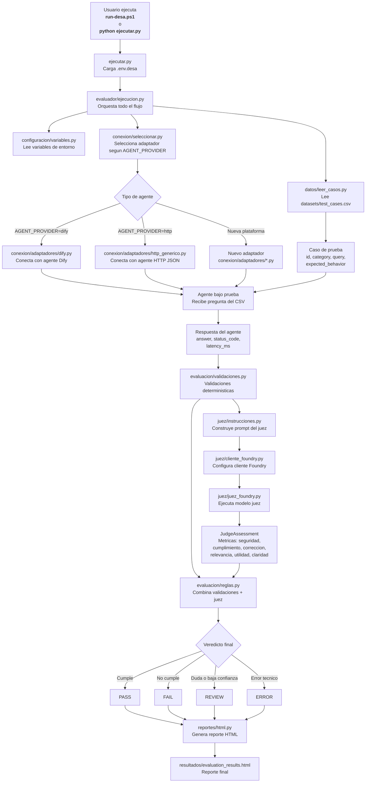

# Diagrama de ejecucion del framework

Este diagrama muestra el flujo completo desde que se ejecuta el framework hasta que se genera el reporte HTML.



## Lectura rapida del flujo

1. El usuario inicia la ejecucion con `run-desa.ps1` o `python ejecutar.py`.
2. `ejecutar.py` carga `.env.desa`.
3. `evaluador/ejecucion.py` coordina todo.
4. `configuracion/variables.py` lee las variables necesarias.
5. `datos/leer_casos.py` lee el CSV con los casos de prueba.
6. `conexion/seleccionar.py` decide que adaptador usar.
7. El adaptador envia la pregunta al agente bajo prueba.
8. El agente responde.
9. `validaciones.py` revisa reglas simples como HTTP, respuesta vacia, latencia y contenido obligatorio o prohibido.
10. `instrucciones.py` construye el prompt para el juez.
11. `juez_foundry.py` llama al modelo juez en Foundry.
12. `reglas.py` combina las validaciones y la evaluacion del juez.
13. Se obtiene un veredicto final: `PASS`, `FAIL`, `REVIEW` o `ERROR`.
14. `html.py` genera `resultados/evaluation_results.html`.

## Responsabilidad de cada bloque

| Bloque | Responsabilidad |
| --- | --- |
| `ejecutar.py` | Punto de entrada visible. |
| `evaluador/ejecucion.py` | Controla la ejecucion completa. |
| `evaluador/configuracion` | Lee `.env.desa` y valida configuracion. |
| `evaluador/datos` | Lee y valida el CSV. |
| `evaluador/conexion` | Decide como conectarse al agente. |
| `evaluador/conexion/adaptadores` | Implementa la conexion concreta con Dify, HTTP u otra plataforma. |
| `evaluador/evaluacion` | Define modelos, validaciones y reglas finales. |
| `evaluador/juez` | Construye el prompt y consulta Foundry. |
| `evaluador/reportes` | Genera el reporte HTML. |
| `resultados` | Guarda el reporte final. |

## Como interpretar adaptadores

```text
Mismo agente en Dify o nuevo agente en Dify
  -> usar conexion/adaptadores/dify.py

Agente con endpoint HTTP JSON simple
  -> usar conexion/adaptadores/http_generico.py

Agente con API especial
  -> crear nuevo archivo en conexion/adaptadores/
```

